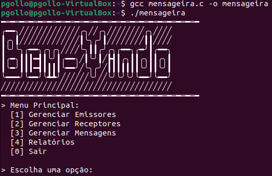

# Pulse - Reprodutor Musical em Java

> O Pulse é um reprodutor musical desenvolvido por Pedro Gollo, Bárbara Schneider e Franco Michelon durante a disciplina de Projeto Temático 1, no âmbito do curso de Análise e Desenvolvimento de Sistemas da Universidade de Caxias do Sul. Este aplicativo foi concebido com o objetivo de aplicar os conhecimentos adquiridos ao longo do curso, com ênfase em programação orientada a objetos (POO), fundamentos de banco de dados e princípios fundamentais de engenharia de software. O Pulse oferece aos usuários uma experiência musical completa e prática, sendo uma demonstração da capacidade de desenvolver aplicações funcionais e eficazes usando a linguagem Java e a interface gráfica do Swing.

## 🔧 Tecnologias Utilizadas

No projeto, a principal tecnologia adotada foi o Java, utilizando a biblioteca Swing para a interface gráfica, com o ambiente de desenvolvimento Eclipse. O banco de dados escolhido foi o MySQL.

## 💻 Pré-requisitos

Antes de começar, verifique se você atende aos seguintes requisitos:

- Você tem uma máquina Windows
- Você instalou a versão mais recente do MySQL
- Você instalou e configurou o Eclipse IDE

## 🚀 Instalando o Pulse

Para instalar o aplicativo, siga estas etapas:

- Importe o arquivo "Pulse.zip" no Eclipse
- Modifique o arquivo "/Pulse/auxiliar/properties/database.properties" para acessar o seu banco de dados
- Execute o arquivo "Principal" que possui o método main

## ☕ Usando o Pulse

Para um melhor entendimento do funcionamento do aplicativo, recomenda-se ler a seção 5 do <a href="/Artigo.pdf">artigo do projeto</a>.

## 🤝 Colaboradores

Agradecemos às seguintes pessoas que contribuíram para este projeto:

<table>
  <tr>
    <td align="center">
      <a href="https://github.com/pbgollo" title="Perfil do Pedro Gollo no GitHub">
         
        
          <b>Pedro Gollo</b>
        
      </a>
    </td>
    <td align="center">
      <a href="https://github.com/Schneiderella" title="Perfil da Bárbara no GitHub">
         
        
          <b>Bárbara Schneider</b>
        
      </a>
    </td>
    <td align="center">
      <a href="https://github.com/FasterThanM" title="Perfil do Franco no GitHub">
         
        
          <b>Franco Michelon</b>
        
      </a>
    </td>
  </tr>
</table>
